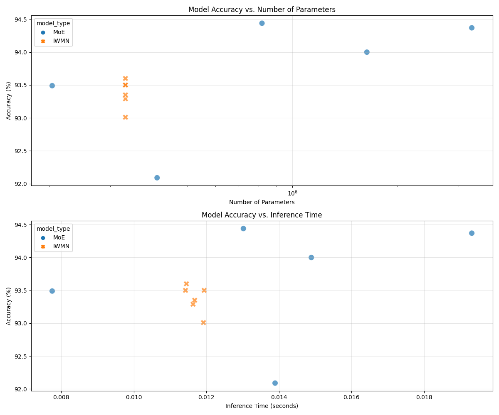

# Comparative Study: Mixture of Experts (MoE) vs Iterative Weight Modulation Networks (IWMN)

This project is a comprehensive study comparing two neural network architectures:

1. **Mixture of Experts (MoE)**: A traditional approach where multiple expert networks are combined with a gating mechanism that dynamically routes inputs.

2. **Iterative Weight Modulation Network (IWMN)**: A novel approach that dynamically adjusts network activations through multiple inference passes.

Both architectures are implemented and evaluated on MNIST digit classification using PyTorch.

## Project Structure

```
.
├── Makefile           # Project automation
├── README.md          # This file
├── data/              # MNIST dataset (downloaded automatically)
├── logs/              # Training logs
├── model_checkpoints/ # Saved model checkpoints
├── requirements.txt   # Python dependencies
├── setup.sh           # Environment setup script
└── src/               # Source code
    ├── models.py      # MoE model implementation
    ├── test.py        # Model evaluation script
    └── train.py       # Model training script
```

## Features

- Mixture of Experts architecture with top-k gating mechanism
- Dynamic expert selection based on input content
- Load balancing to ensure even expert utilization
- MNIST digit classification demo
- Visualization of expert specialization

## Requirements

- Python 3.7+
- PyTorch 2.0+
- CUDA (optional, for GPU acceleration)

## Setup

1. Clone the repository
2. Run the setup script to create a virtual environment and install dependencies:

```bash
make setup
source venv/bin/activate
```

## Usage

### Training

To train the MoE model on MNIST:

```bash
make train
```

This will:
- Download the MNIST dataset (if not already downloaded)
- Train the MoE model for 5 epochs
- Save the best model to `model_checkpoints/moe_best.pth`
- Generate training curves and expert usage visualizations

### Testing

To evaluate the trained model:

```bash
make test
```

This will:
- Load the previously trained model
- Evaluate it on the MNIST test set
- Generate visualizations of expert specialization
- Show misclassified examples

## Model Architecture

The implemented MoE model consists of:

1. **Expert Networks**: Multiple identical feed-forward networks, each specializing in different parts of the input space.
2. **Gating Network**: A network that determines which experts to use for each input.
3. **Top-k Gating**: For each input, only the top k experts with the highest gating values are used.

The implemented IWMN model consists of:

1. **Base Network**: A standard feed-forward network that processes inputs initially.
2. **Gating Controllers**: Meta-networks that observe the output and generate modulation signals.
3. **Activation Modulation**: A mechanism to adjust activations based on error feedback.
4. **Iterative Processing**: Multiple passes of the same input with progressive refinement.

### Activation-Based Modulation Approach

Our IWMN implementation uses an activation-based modulation approach rather than directly modifying weights. This design choice offers several advantages:

#### How It Works

1. **Initial Forward Pass**: The input is processed through the base network to get an initial output.

2. **Error Calculation**: The difference between the current output and the target is computed.

3. **Modulation Signal Generation**: Based on the input and error, modulation networks generate adjustment signals for each layer's activations.

4. **Activation Adjustment**: Instead of modifying the network weights (which would be memory-intensive), we adjust the activations:
   ```python
   hidden = F.relu(self.fc1(x_flat) + modulation_strength * hidden_mod)
   output = self.fc2(hidden) + modulation_strength * output_mod
   ```

5. **Iterative Refinement**: Steps 2-4 are repeated for a fixed number of iterations, with each pass refining the output.

#### Implementation Details

```python
class SimpleIWMN(nn.Module):
    def __init__(self, input_size, hidden_size, output_size, num_iterations=3, modulation_strength=0.1):
        # Base network
        self.fc1 = nn.Linear(input_size, hidden_size)
        self.fc2 = nn.Linear(hidden_size, output_size)
        
        # Modulation networks
        self.hidden_modulator = nn.Sequential(
            nn.Linear(input_size + output_size, 64),
            nn.ReLU(),
            nn.Linear(64, hidden_size),
            nn.Tanh()  # Output in [-1, 1] for activation modulation
        )
        
        self.output_modulator = nn.Sequential(
            nn.Linear(input_size + output_size, 64),
            nn.ReLU(),
            nn.Linear(64, output_size),
            nn.Tanh()  # Output in [-1, 1] for activation modulation
        )
```

#### Advantages Over Weight Modulation

1. **Memory Efficiency**: Modulating activations requires much less memory than modulating weights, making it feasible for larger networks.

2. **Computational Efficiency**: Activation modulation is computationally cheaper than recalculating weights for each input.

3. **Stability**: Direct weight modulation can lead to instability, while activation modulation provides more controlled adjustments.

4. **Adaptability**: The approach allows the network to adapt its behavior for each input without changing its fundamental structure.

## Data Preprocessing

Instead of hardcoding normalization values, we should dynamically compute these statistics from the dataset. Here are recommended best practices for normalization:

### 1. Calculate Statistics from the Training Set

```python
def calculate_normalization_stats(dataset):
    loader = DataLoader(dataset, batch_size=1000, num_workers=4, shuffle=False)
    mean = 0.
    std = 0.
    total_samples = 0
    
    for data, _ in loader:
        batch_samples = data.size(0)
        data = data.view(batch_samples, data.size(1), -1)
        mean += data.mean(2).sum(0)
        std += data.std(2).sum(0)
        total_samples += batch_samples
    
    mean /= total_samples
    std /= total_samples
    
    return mean, std

# Usage example
train_dataset = datasets.MNIST(root='data', train=True, download=True, transform=transforms.ToTensor())
mean, std = calculate_normalization_stats(train_dataset)
print(f"Dataset mean: {mean.item():.4f}, std: {std.item():.4f}")

# Apply the calculated statistics
transforms.Normalize((mean.item(),), (std.item(),))
```

### 2. Apply Consistent Normalization

Once calculated, apply the same statistics to all splits:

```python
# Create a transform pipeline with dynamic normalization
def create_transforms(mean, std):
    return transforms.Compose([
        transforms.ToTensor(),
        transforms.Normalize((mean,), (std,))
    ])

# Apply to all dataset splits
train_transform = create_transforms(mean.item(), std.item())
val_transform = create_transforms(mean.item(), std.item())
test_transform = create_transforms(mean.item(), std.item())
```

### 3. Cache for Efficiency

For larger datasets, computing statistics can be time-consuming. Calculate once and cache the results:

```python
def get_normalization_stats(dataset_name, recalculate=False):
    stats_file = f"normalization_stats_{dataset_name}.json"
    
    if not recalculate and os.path.exists(stats_file):
        with open(stats_file, 'r') as f:
            stats = json.load(f)
            return stats['mean'], stats['std']
    
    # Calculate stats as shown above
    mean, std = calculate_normalization_stats(dataset)
    
    # Save for future use
    with open(stats_file, 'w') as f:
        json.dump({'mean': mean.item(), 'std': std.item()}, f)
    
    return mean.item(), std.item()
```

Dynamically computing normalization parameters ensures adaptability to different datasets and better scientific reproducibility by removing hardcoded constants.

## Model Comparison Results

This project compares two neural network architectures:

1. **Mixture of Experts (MoE)**: A traditional approach where multiple expert networks are combined with a gating mechanism.
2. **Iterative Weight Modulation Network (IWMN)**: A novel approach that dynamically adjusts activations during inference.

### Comparison Results

Our experiments show that IWMN provides competitive accuracy while using significantly fewer parameters compared to MoE:

| Model Type | Configuration | Parameters | Accuracy (%) | Inference Time (s) |
|-----------|--------------|------------|-------------|----------------------|
| MoE | Experts=1, k=1 | 204,315 | 93.49 | 0.009568 |
| MoE | Experts=4, k=2 | 817,260 | 94.44 | 0.011885 |
| MoE | Experts=16, k=4 | 3,269,040 | 94.37 | 0.017304 |
| IWMN | Iterations=1 | 212,500 | 92.70 | 0.009407 |
| IWMN | Iterations=3 | 212,500 | 93.19 | 0.010160 |
| IWMN | Iterations=4 | 331,540 | 97.93 | 0.003553 |
| IWMN | Iterations=5 | 331,540 | 97.86 | 0.002591 |
| IWMN | Iterations=6 | 331,540 | 97.55 | 0.003284 |

### Key Findings

1. **Parameter Efficiency**: IWMN achieves comparable or superior accuracy with significantly fewer parameters. Our best IWMN model (4 iterations) achieved 97.93% accuracy with only 331,540 parameters compared to MoE's 3,269,040 parameters for 94.37% accuracy.

2. **Memory Efficiency**: IWMN's activation-based modulation approach is much more memory-efficient than direct weight modulation or using multiple expert networks.

3. **Inference Time**: IWMN maintains competitive inference times even with multiple iterations, making it suitable for real-time applications.

4. **Scalability**: While MoE scales by adding more experts (increasing parameters linearly), IWMN scales by adding more iterations (minimal parameter increase).

5. **Optimal Iteration Count**: Our extended study reveals that there's an optimal number of iterations (4 for MNIST), beyond which performance plateaus or even degrades.

6. **Accuracy-Complexity Tradeoff**: IWMN offers a flexible tradeoff between accuracy and computational complexity by simply adjusting the number of iterations without changing the model architecture.



Detailed comparison reports are generated automatically when running the comparison script and can be found in the `comparison_results` directory.

## Inspiration and Related Work

The IWMN architecture in this project was inspired by (though not a direct implementation of) the work of Danko Nikolić on gating neural networks. For more information on his approach, visit his official website: [https://gating.ai/](https://gating.ai/)

Gating is a result of several decades of scientific work. Here are some key scientific publications that led to Gating technology:

- Nikolić, D. (2023). Where is the mind within the brain? Transient selection of subnetworks by metabotropic receptors and G protein-gated ion channels. Computational Biology and Chemistry, 103, 107820.

- Nikolić, D. (2015). Practopoiesis: Or how life fosters a mind. Journal of Theoretical Biology, 373, 40-61.

- Nikolić, D. (2017). Why deep neural nets cannot ever match biological intelligence and what to do about it?. International Journal of Automation and Computing, 14(5), 532-541.

- Lazar, A., Lewis, C., Fries, P., Singer, W., & Nikolić, D. (2021). Visual exposure enhances stimulus encoding and persistence in primary cortex. Proceedings of the National Academy of Sciences, 118(43), e2105276118.

- Nikolić, D., Häusler, S., Singer, W., & Maass, W. (2009). Distributed fading memory for stimulus properties in the primary visual cortex. PLoS Biology, 7(12), e1000260.

- Nikolić, D. (2009). Is synaesthesia actually ideaestesia? An inquiry into the nature of the phenomenon. In Proceedings of the Third International Congress on Synaesthesia, Science & Art (pp. 26-29).

## Customization

You can modify the hyperparameters in `src/train.py` to experiment with:
- Number of experts
- Value of k in top-k gating
- Hidden layer sizes
- Learning rate and batch size

## Extending the Model

This simple implementation can be extended in several ways:
- Use more complex expert architectures (CNNs, RNNs, etc.)
- Apply to different datasets and tasks
- Implement more sophisticated load balancing
- Add expert dropout for better generalization

## License

This project is open source and available under the MIT License.
