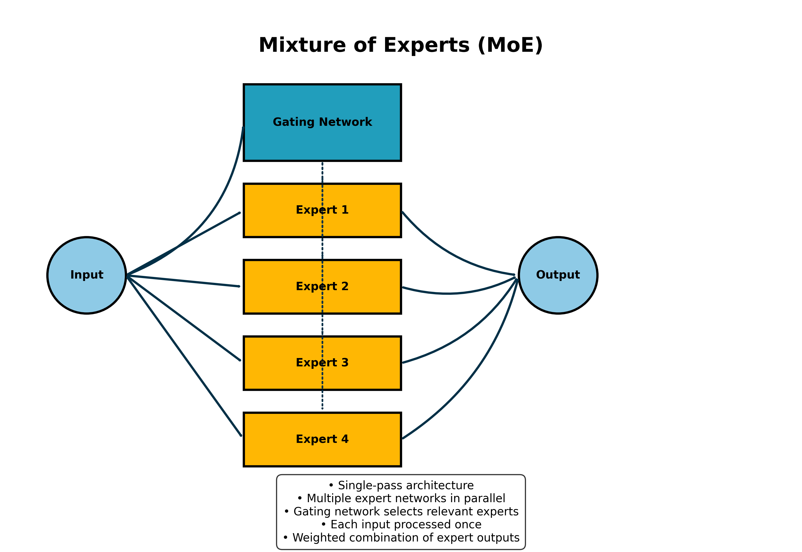
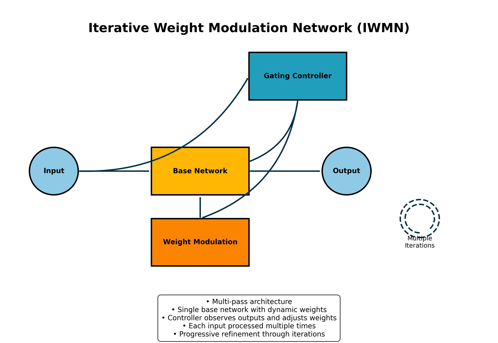

# MoE vs IWMN Architecture Comparison

## Mixture of Experts (MoE)

### Key Characteristics:
- **Parallel Processing**: Uses multiple expert networks that process inputs simultaneously
- **Single-Pass Inference**: Input is processed in a single forward pass through the network
- **Gating Mechanism**: A dedicated gating network determines which experts to use for each input
- **Expert Specialization**: Different experts specialize in different parts of the input space
- **Sparse Activation**: Typically only a subset of experts (top-k) are activated for any given input

### Processing Flow:
1. Input enters the system
2. Gating network evaluates input and assigns weights to each expert
3. Input is processed by all experts in parallel
4. Final output is a weighted combination of expert outputs based on gating weights

## Iterative Weight Modulation Network (IWMN)

### Key Characteristics:
- **Dynamic Weight Adjustment**: Network weights are modified between iterations
- **Multi-Pass Inference**: Input is processed multiple times with refined weights
- **Adaptive Feedback**: Outputs from previous passes inform weight adjustments
- **Progressive Refinement**: Each iteration improves the prediction

### Processing Flow:
1. Input enters the base network
2. First-pass output is produced
3. Gating controller evaluates the input and output to generate modulation signals
4. Network weights are adjusted based on modulation signals
5. Input is processed again with the adjusted weights
6. Steps 3-5 repeat for a fixed number of iterations
7. Final output comes from the last iteration

## Key Differences

| Feature | MoE | IWMN |
|---------|-----|------|
| Network Structure | Multiple parallel networks | Single network with dynamic weights |
| Inference Pattern | Single-pass | Multi-pass (iterative) |
| Adaptation Mechanism | Expert selection | Weight modulation |
| Parameter Efficiency | Lower (multiple experts) | Higher (weight sharing across iterations) |
| Computational Pattern | Parallel computation | Sequential refinement |

The fundamental conceptual difference is that MoE achieves adaptability through specialization and selection (choosing the right experts), while IWMN achieves adaptability through iteration and refinement (repeatedly adjusting a single network).
