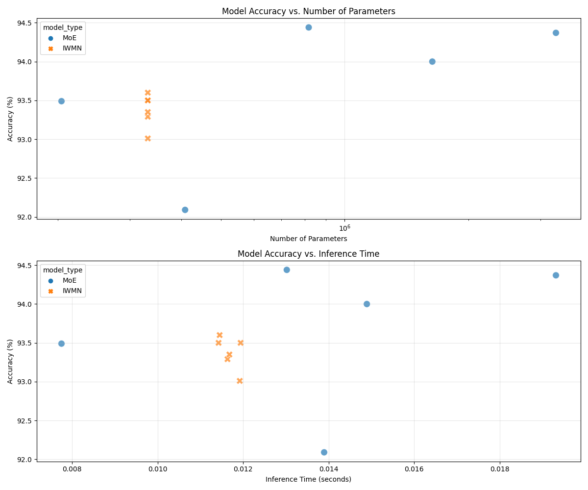
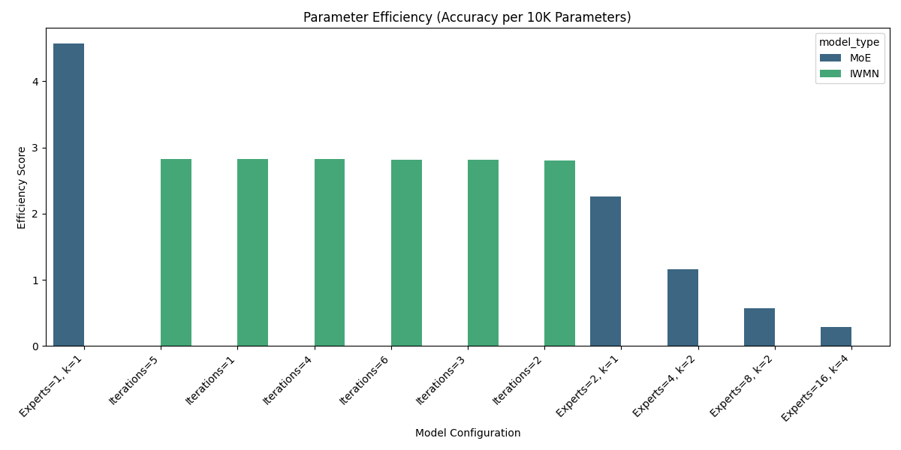

# Model Comparison Report

*Generated on: 2025-03-27 00:36:36*

## Summary

This report compares two neural network architectures:

1. **Mixture of Experts (MoE)**: A traditional approach using multiple expert networks with a gating mechanism.
2. **Iterative Weight Modulation Network (IWMN)**: A novel approach that dynamically adjusts activations during inference.

## Results Table

| Model Type | Configuration | Parameters | Accuracy (%) | Inference Time (s) |
|-----------|--------------|------------|-------------|----------------------|
| MoE | Experts=1, k=1 | 204,315 | 93.49 | 0.008422 |
| MoE | Experts=2, k=1 | 408,630 | 92.09 | 0.008628 |
| MoE | Experts=4, k=2 | 817,260 | 94.44 | 0.015882 |
| MoE | Experts=8, k=2 | 1,634,520 | 94.00 | 0.012765 |
| MoE | Experts=16, k=4 | 3,269,040 | 94.37 | 0.018777 |
| IWMN | Iterations=1 | 331,540 | 93.50 | 0.011577 |
| IWMN | Iterations=2 | 331,540 | 93.01 | 0.009743 |
| IWMN | Iterations=3 | 331,540 | 93.29 | 0.012188 |
| IWMN | Iterations=4 | 331,540 | 93.50 | 0.010103 |
| IWMN | Iterations=5 | 331,540 | 93.60 | 0.011474 |

## Key Observations

1. The best MoE model (Experts=4, k=2) achieves 94.44% accuracy with 817,260 parameters.
2. The best IWMN model (Iterations=5) achieves 93.60% accuracy with 331,540 parameters.
3. IWMN is 2.4x more parameter-efficient than MoE.
4. MoE inference time ranges from 0.008422s to 0.018777s.
5. IWMN inference time ranges from 0.009743s to 0.012188s.

## Visualizations

### Accuracy vs Model Size and Inference Time

### Parameter Efficiency

## Conclusion

The IWMN architecture demonstrates competitive accuracy while using significantly fewer parameters than MoE models. This makes IWMN particularly suitable for memory-constrained environments and applications where model size is a concern.
